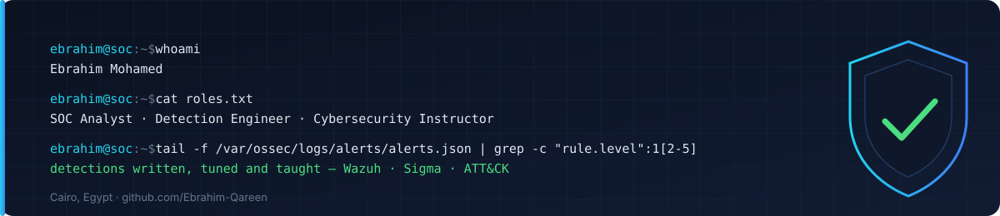

<h1 align="center">Hi, I'm Ebrahim Mohamed</h1>

  

  
  
  
  
  

---

I work on both sides of the SOC: during the day I triage alerts, write and tune detection rules, and hunt threats on production Wazuh estates; the rest of the time I build and teach diploma-level cybersecurity programs. Every course I publish is built from the same detections, incidents and lab work I run myself.

## 🛡️ What I do

| 🔵 Blue team (SOC) | 🎓 Training & course design |
|---|---|
| Alert triage, incident reporting and threat hunting on a multi-tenant Wazuh SIEM | Lead Cybersecurity Instructor — SOC, CEH, eCIR and eCDFP diploma tracks |
| Detection engineering: PCRE2 rules, decoders, sibling/level tuning, rule-ID architecture across environments | Full session packages: instructor guide, student guide, guided lab, quiz, homework |
| SOAR enrichment and response (Shuffle, VirusTotal, AbuseIPDB) | Static-HTML course sites that run offline in a classroom |
| Log sources: Cloudflare, Nginx, Google Workspace, Azure, Windows, Linux, FIM | Investigation challenges and CTF-style capstones mapped to MITRE ATT&CK |

## 🧰 Tech stack

  

### SIEM & detection

  
  
  
  
  
  
  
  
  

### Response & SOAR

  
  
  
  
  

### Network & perimeter

  
  
  
  
  
  

### Forensics & malware analysis

  
  
  
  
  
  

### Offensive (for detection validation)

  
  
  
  
  
  

## 📌 Featured work

| Repository | What it is | Stack |
|---|---|---|
| [ecdfp-diploma](https://github.com/Ebrahim-Qareen/ecdfp-diploma) | Windows digital forensics diploma (INE eCDFP) — 6 sessions, one carry-through investigation, verified-evidence policy, render/density gates | HTML · Python · PowerShell |
| [ecir-diploma](https://github.com/Ebrahim-Qareen/ecir-diploma) | Enterprise incident response diploma (INE eCIR) — 10 sessions, SOC lab, investigation challenges, cheat sheets | HTML · Wazuh |
| [ceh-diploma](https://github.com/Ebrahim-Qareen/ceh-diploma) | CEH diploma — session pages, topic map, lab topology, practice-platform index | HTML · Python |
| [Wazuh-SIEM-Integration](https://github.com/Ebrahim-Qareen/Wazuh-SIEM-Integration) | Multi-OS Wazuh lab: Sysmon, FIM + VirusTotal, Suricata, active response, DVWA attacks with 10 ATT&CK-mapped custom rules | Wazuh · Suricata · Linux · Windows |
| [Network-Attack-Simulation-Lab](https://github.com/Ebrahim-Qareen/Network-Attack-Simulation-Lab) | pfSense + Snort lab — 8 attack scenarios (recon, DoS, ARP/DNS spoofing, DNS tunnelling, C2, brute force) with custom rules | pfSense · Snort · Kali |

Live course sites: [eCDFP](https://ecdfp-diploma.vercel.app) · [eCIR](https://ecir-diploma.vercel.app) · [CEH](https://ceh-diploma.vercel.app)

## 🏠 Home lab — "Cybersecurity Corp"

VMware environment used to develop and validate everything above: Sophos XG perimeter, Windows Server 2025 domain controller, Wazuh manager, domain-joined Windows 11/10/7 and Ubuntu endpoints with agents, Kali Purple as the attacker host, DVWA as the web target. An IAM/PAM extension (PowerShell identity lifecycle, Keycloak SSO + MFA, Windows LAPS, tiered admin model) is in progress.

## 🎯 Currently

- Rebuilding a unified multi-environment Wazuh ruleset (per-environment rule files, readable ID scheme, no cross-tenant firing)
- Building the eCDFP and CEH diploma packages session by session
- Preparing for INE eTHP (Threat Hunting)

## 📊 GitHub stats

  
  

  

<i>"The best defense is understanding how the offense thinks."</i>

